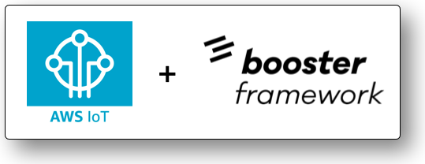

<p align="center">
  
  <p align="center">
    
  
  </p>
</p>
 
# Rocket to integrate AWS IOT with Booster Framework
## What is this?
Internet of Things (IOT) applications are very related with event based applications because normally sensors generate events that can be processed and other parts of the system can react to them. 

This Booster Rocket enables the possibility to receive IOT events in a [Booster application](https://booster.cloud) when a new event is publish from a sensor connected to the [AWS IOT MQTT](https://aws.amazon.com/iot/) broker.

## How it works?
The way to integrate your Booster Project with the AWS IOT MQTT broker is really simple:

**1. Add the rocket to your Booster Project**, add this dependency to your `package.json`:
```typescript
"DevDependencies": {
  "rocket-mqtt-aws-infrastructure": "^1.0.61"
}
```

**2. Initialize the rocket in your project** adding the following code to your `config.ts`:
```typescript
config.provider = config.provider = Provider([
    {
      packageName: 'rocket-mqtt-aws-infrastructure',
      parameters: {
        topics: ['test/sensor1', 'test/sensor2', 'test/sensor3'],
        config: config,
      },
    },
  ])
```
The array `topic` contains all your desired topics. Everytime that a new measurement is published in those topics a new event will be created in your Booster application

 **3. Create a new Event in your project.** You can create the event using the [Booster CLI](https://github.com/boostercloud/booster/tree/master/docs/#3-first-event) or manually:
 ```typescript
 import { Event } from '@boostercloud/framework-core'
import { UUID } from '@boostercloud/framework-types'

@Event
export class MeasurementCreated {
  public constructor(
    readonly measurementId: UUID,
    readonly timestamp: string,
    readonly topic: string,
    readonly data: string
  ) {}

  public entityID(): UUID {
    return this.measurementId
  }
}
```
When a sensor publish a new measurement into a MQTT topic that you are tracking, your Booster Application will receive a new `MeasurementCreated` event. This event includes the `timestamp`, the `topic` where the message was published and the payload of your MQTT message into the `data` field.

**4. Create a new Entity in your project** In the same way as the event you can use the [Booster CLI](https://github.com/boostercloud/booster/tree/master/docs/#4-first-entity) or create it manualy:
```typescript
import { Entity, Reduces } from '@boostercloud/framework-core'
import { UUID } from '@boostercloud/framework-types'
import { MeasurementCreated } from '../events/measurement-created'

@Entity
export class Measurement {
  public constructor(public id: UUID, readonly timestamp: string, readonly topic: string, readonly data: string) {}

  @Reduces(MeasurementCreated)
  public static reduceMeasurementCreated(event: MeasurementCreated): Measurement {
    return new Measurement(event.measurementId, event.timestamp, event.topic, event.data)
  }
}
```

**5. Create a Read Model** using the [Booster CLI](https://github.com/boostercloud/booster/tree/master/docs/#5-first-read-model) or manually:
```typescript
import { ReadModel, Projects } from '@boostercloud/framework-core'
import { UUID, ProjectionResult } from '@boostercloud/framework-types'
import { Measurement } from '../entities/measurement'

@ReadModel({
  authorize: 'all',
})
export class MeasurementReadModel {
  public constructor(public id: UUID, readonly timestamp: string, readonly topic: string, readonly sensor: string, readonly measurement: number) {}

  @Projects(Measurement, 'id')
  public static projectMeasurement(entity: Measurement): ProjectionResult<MeasurementReadModel> {
    const parsedData = JSON.parse(entity.data)
    const sensorName = parsedData.sensor //this is specific to your MQTT received Data
    const measurement = parsedData.measurement // this is specific to your MQTT received Data
    return new MeasurementReadModel(entity.id, entity.timestamp, entity.topic, sensorName, measurement)
  }
}
```
**NOTE:** Inside the Read Model you can perform data transformation between the received event from the MQTT broker and your client logic.

**6. Deploy your application** using the Booster CLI:
```bash
boost deploy -e production
```

## Any question?
If you have any question or doubt about how this rocket works ping me or reach me in the [Booster Framework Discord](https://discord.gg/bDY8MKx)

## Contributing
Pull requests are welcome. For major changes, please open an issue first to discuss what you would like to change.

## License
This project is licensed under the Apache License, Version 2.0.